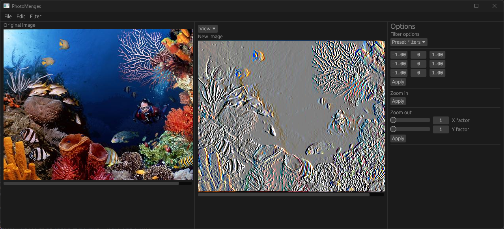

# FPI

This repository contains all work done for the Fundamentals of Image Processing course.

## basic_ops

Contains basic image processing operations, such as:
- Flip
- Luminance (black and white)
- Rotation (horizontal and vertical)
- Zoom
- Kernel filters
- Histogram calculation
- Histogram matching
- Quantization
- Linear operations (brightness, contrast, negative)
- Convolution with kernel filters

## ui

Constains UI using eGUI for such operations.

